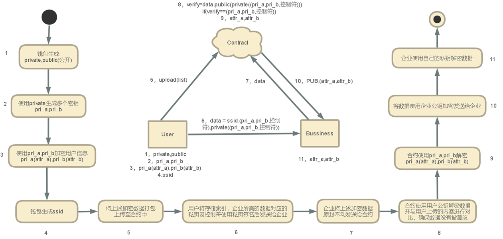
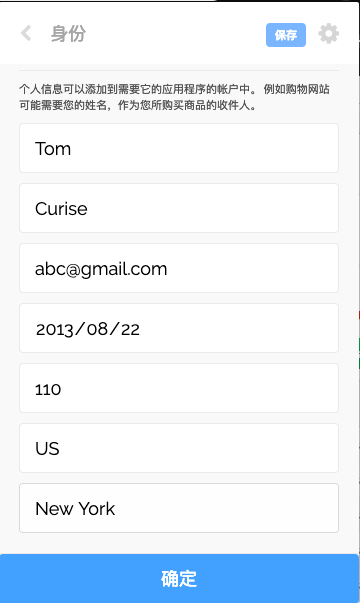
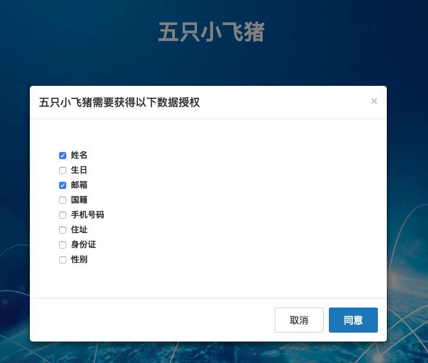
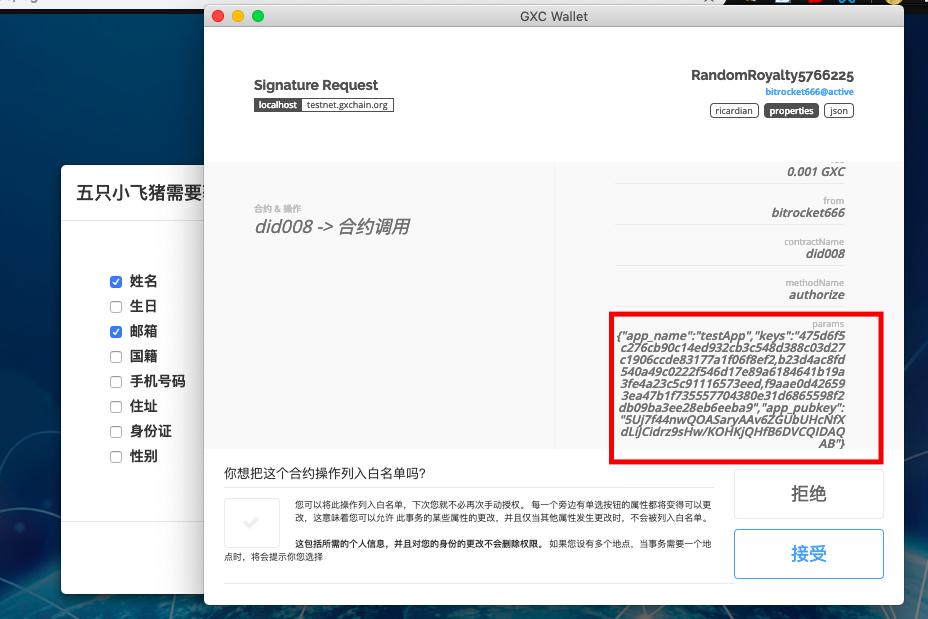
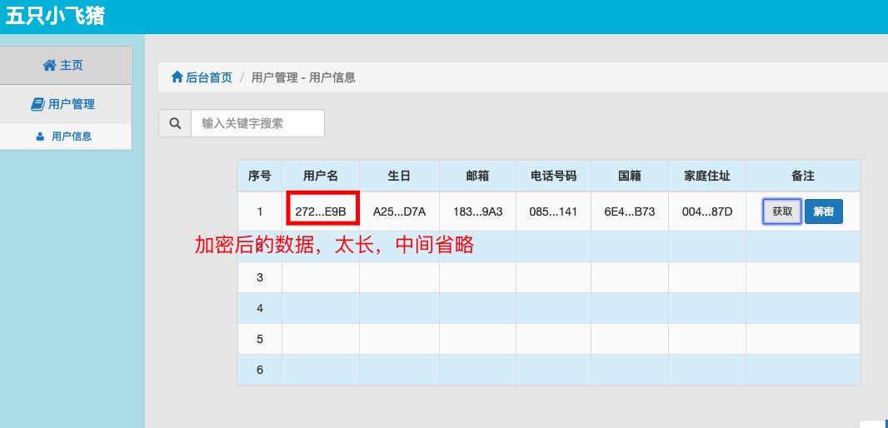
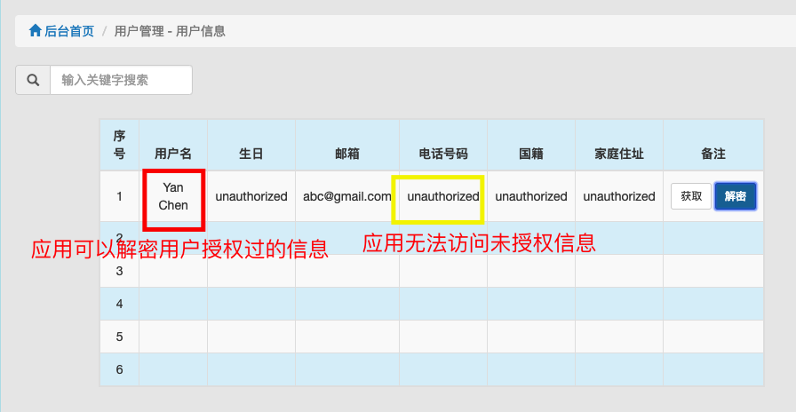

# 去中心化数字身份管理平台
2019 Bitrun Hangzhou Hackathon  
Group Member: 黄诤杰 陈岩 张淼 刘万 杨天泽 

## Overview

### 1.用户身份管理

​	1.用户创建GXChain账户

​	2.使用用户账户私钥生成多个子秘钥

​	3.用户在GScatter钱包中填写个人信息，信息提交到合约前使用对应的子秘钥加密

​	4.每个账户对应一个身份信息，身份信息目前包含姓名、生日、email、电话等基本字段，可随时更新

### 2.使用身份在第三方应用登录

​	1.在第三方应用页面登录时，第三方应用向用户请求访问个人信息的权限

​	2.用户勾选允许第三方应用访问的个人数据，使用对应的解密子秘钥、应用公钥调用合约的authorize函数

​	3.authorize函数使用用户提供的子秘钥解密对应字段，然后用应用公钥加密

​	4.应用向合约请求用户数据，在本地使用自己的私钥解密相应字段

### 3.架构图

### 4.演示流程

​	1.用户填写个人信息并点击确认上传到合约

​	2.用户尝试登陆第三方应用，第三方应用请求访问用户数据，用户勾选允许第三方应用访问的数据

​	3.用户使用用于加密对应字段的子秘钥和应用公钥调用合约的authorize函数，authorize函数用子秘钥解密字段并用应用公钥加密之

​	4.应用可以从合约获取加密后的用户数据

​	5.应用可在本地用自己的私钥解密用户授权的字段

